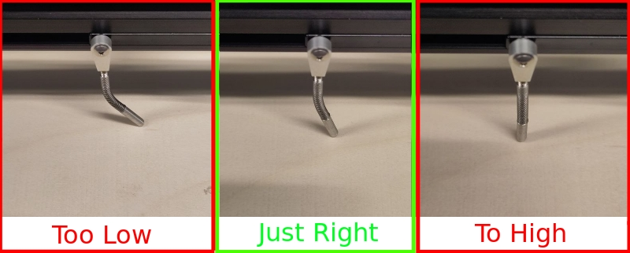
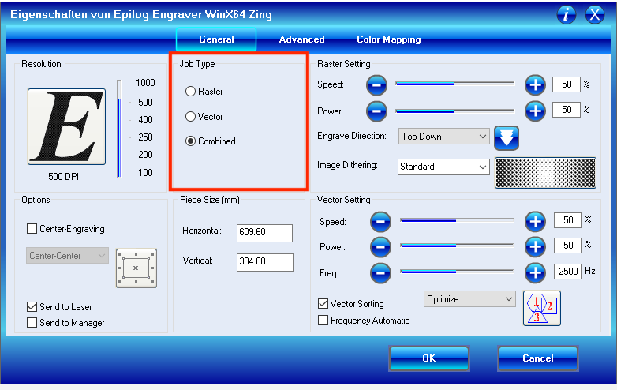
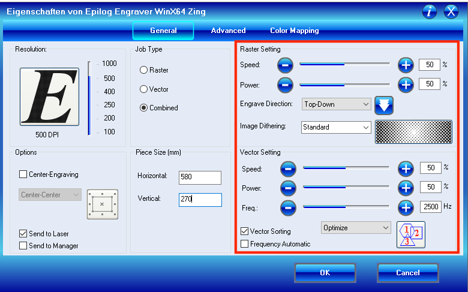
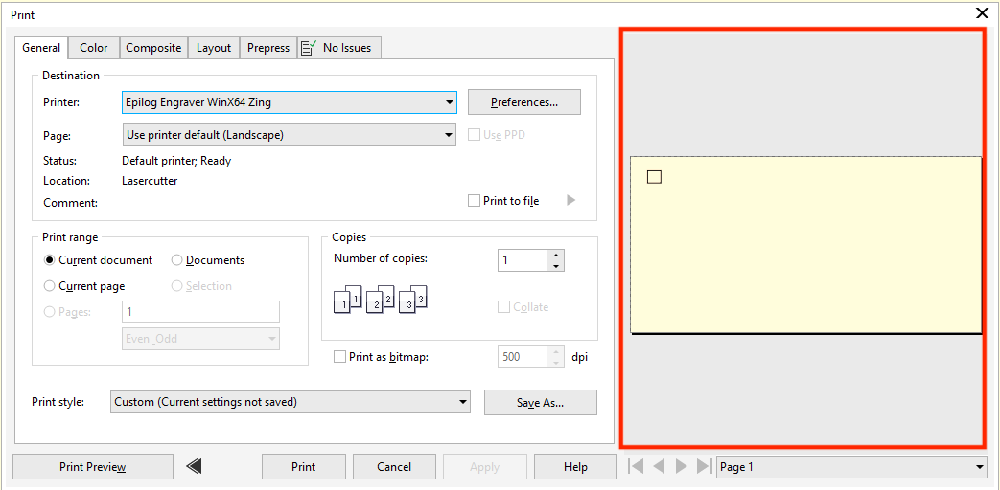

## General

[Laser Cutter Manual](https://www.epiloglaser.com/assets/downloads/manuals/zing-manual-web.pdf)

The laser cutter operates like a printer. In order to cut or engrave something, you need a vector graphic (i.e. _.svg_ or _.dxf_). This file can the be opened in Corel Draw on the workstation PC.

The overall space in which the laser cutter can operate is 590mm x 280mm.

## Cutting Specs

Cutting only happens with lines that have a thickness of "Hairline", anything else will be ignored.

## Engraving Specs

In order to engrave something, you need to convert your Picture/Text/Forms. In order to do that, select your objects and click on _Objects -> Convert Outline to Object_.

## Setup

Please check if the laser cutter is able to cut (or engrave) your material. For this take a look at the [Settings](#Settings) section.

Turn on the laser cutter (the switch is on the right side) and the ventilation (button on the front). Open the laser cutter and place the material on the grid box. Depending on the thickness of the material, the grid box needs to be lowered or increased. In order to do that, unlock the X/Y axis by pressing button 8. Firmly pull the black axis towards you (**Do not touch the lens on the left side!**), so that it is above your material. Then Unlock the silver spacer, so that it faces towards the material. With button 3 and 4, you can increase or lower the grid box. The silver spacer should not be able to swing, but also not be bend to much (max 20°). 

If you reached the final position press button 0, which will reset the black axis. 
Then turn on the red-dot by pressing button 7, and move the Head so that the red-dot is in the upper-left corner of the grid box. 
You can then press button 7 again to turn off the red-dot.

## Cut/Engrave Something

Open a new Document in Corel Draw, and set a Name for your Printjob. 
Also ensure that the Width is 609.6mm and the Height is 304.8mm. 
You can now use drag and drop to add your svg or dxf Files.

Click on _File -> Print_. The selected printer should be _Epilog Engraver WinX64 Zing_, if not select it. Then click on _Preferences_. In the section _Job Type_ you can select by clicking in of the the radio boxes, if the laser should cut, engrave or do both, as seen below.

Raster = Engraving\
Vector = Cutting\
Combined = Engraving and Cutting

In the section _Piece Size(mm)_ you need to write the dimensions of the grid box(609.6mm*304.8mm). 

Depending on the selected _Job Type_ Raster Setting or Vector Setting might be greyed out. The values you need to fill in here depends on your material. For that, please look into the [Settings](#Settings) section. The values from the image below are the default values. For engraving: Increasing the _power_ attribute will result in a deeper engraving. Feel free to experiment with the values of the raster settings, until your are satisfied with your result.

After you applied all of the settings above, click on _OK_. The preview on the right side should then show your vector graphic, as seen in the picture below. If this looks way too big (or scaled), please go to the tab _Layout_ and check if _Fit to page_ is enabled. This will most likely be the source of the problem. In this case select _As in Document_ and the ratio should be correct. After everything is set you can optionally click on _Apply_, followed by _Print_. The Job is then send to the printer.

Before you cut the actual material, you may want to consider a test cut on paper. Please notice, that you need to increase the position of the grid box as explained before.
Doing some Test Print is also needed to ensure the laser is warmed up and actually cutting.

If everything was successful, the display of the Printer should show a new job. You can do a dry-run by pressing button 7 on the printer, which will activate the red laser, and opening the laser cutter. As long as the laser cutter is open, it will not start cutting. If you press the green button on the laser cutter, it will run along the cutting path, while the laser indicates where the material will be cutted. Please do not close the door of the laser cutter now, as it will directly start to cut and ignores the route so far. The dry-run can be canceled by pressing button 0, but you will need to reset the head as told in the Setup. Close the opening of the laser cutter and press the green button again to start cutting.

## Settings
| Material | Cutting | Engraving |
|----------|---------|-----------|
| Acrylic 3mm | 20s/100p/5000f | 90s/60p |
| Wood 6mm (Deep Engraving) | 20s/100p/500f | 20s/100p |
| Wood 6mm (Normal Engraving) | 20s/100p/500f | 50s/100p |
| cell | cell | cell |

For more information see the [Manufacturer settings](https://www.epiloglaser.de/assets/downloads/zing-material-settings.pdf)

## Maintenance

#### Lens cleaning

TODO

#### Grid Box

Small particles that fall into the grid box can be removed by removing the grid box. In order to do that slightly lift the grid box and move it towards yourself. On the opposite sides of the three openings two green screws, which can be unscrewed to open the grid box. The front plate can then be pulled towards yourself and the grid box is open.\
If you put the grid box back in the laser cutter, please make sure, that the three openings fit into the three openings in the laser cutter.

## Known Issues

- Some Adobe Illustrator versions re-scale the vector graphic during an svg export
  - Please check (or let someone else check) that beforehand
  - Updating Adobe Illustrator might solve the problem
  - If updating is not possible consider an export to a different file type (i.e. _.dwg_)