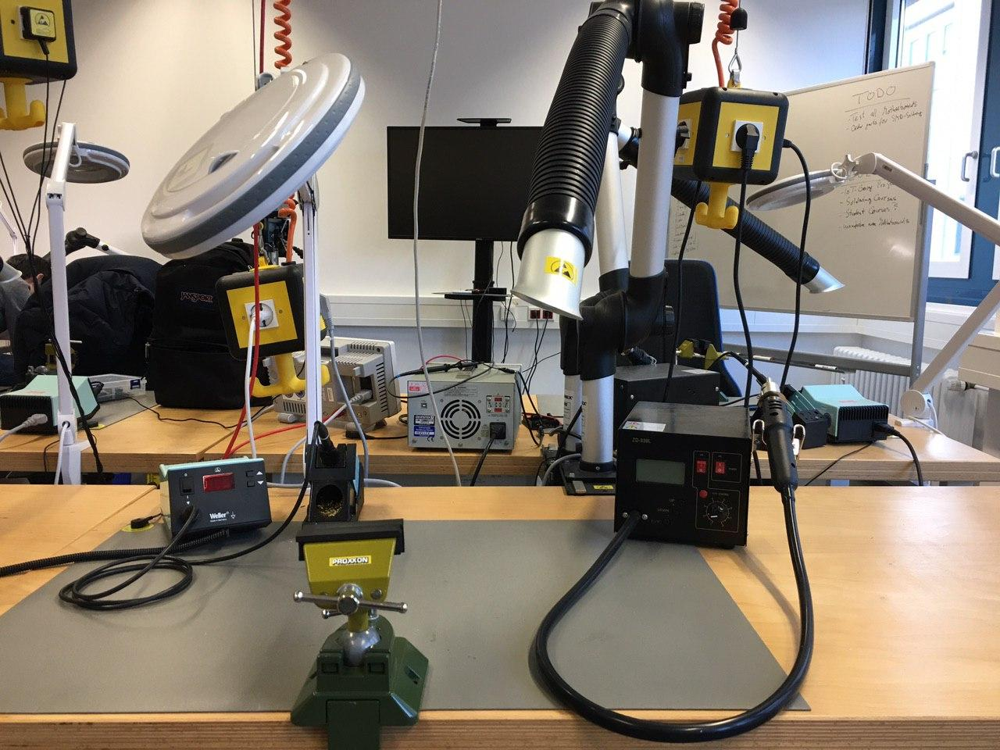
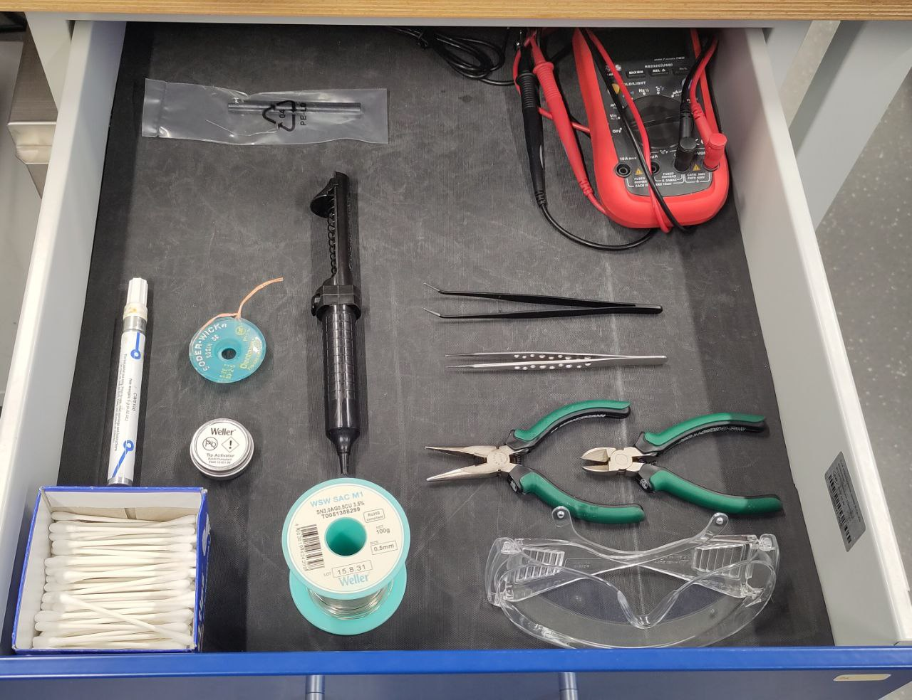

Your workstation should look like the photo. 
At the table is the helping hand (Schraubstock), the soldering iron (Lötkolben), the soldering station (Lötstation) and the SMD solder (SMD Lötmachine). The glass magnifier (Lupe) with the lamp and the ventilation should be arranged like in the photo.  

Every drawer should include:
- pliers/Zange
- side cutter/Seitenschneider
- cotton buds/Wattestäbchen
- tip activator/Löttip
- solder/Lötzinn
- Dispensing Pen
- tweezer/Pinzette
- soldering basics/Lötanleitung
- Multimeter
  - top part/Aufsatz
  - USB-cable/USB-Kabel
  - Temperatursensor
- Soder Wick (Size 2)
- goggles/Schutzbrille
- desoldering pump/Entlötpumpe
- pick-up stick from SMD solder

